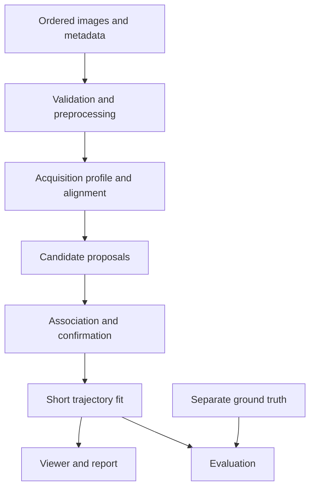

# Architecture and file boundaries

## Chosen stack

Python 3.11 or 3.12, NumPy, OpenCV headless, SciPy, Pydantic, FastAPI, Uvicorn, Pillow and pytest for the backend/core. React + TypeScript + Vite for the viewer; a Canvas overlay is sufficient. Use Streamlit as the explicit fallback if frontend integration cannot meet hour-12 checkpoint. Optional: Astropy for FITS/WCS and a trained YOLO adapter. No database, account system, LLM service, Redis, Celery or mandatory GPU in P0.

Resolve and lock compatible dependencies when creating the actual repository. Research checked API concepts, not a complete dependency matrix. Do not invent a tested version list in documentation.

## Processing flow

Ground truth never enters the processing nodes. Synthetic generation writes images and separate labels; evaluation joins outputs with labels later.

## Package paths for the actual implementation

| Path | Responsibility | Default owner |
|---|---|---|
| `backend/app/main.py`, `api/`, `services/` | API, jobs and artifact access | Integration |
| `backend/app/core/config.py` | Defaults and limits | Integration |
| `backend/app/schemas/` | Pydantic input/output contracts | Integration |
| `backend/orbittrace/io/` | Image manifest and frame loading | Data/CV |
| `backend/orbittrace/synthetic/` | Scene generation and truth export | Data/CV |
| `backend/orbittrace/preprocessing/` | Background/noise handling | Data/CV |
| `backend/orbittrace/registration/` | Common-frame transforms and validity masks | Data/CV |
| `backend/orbittrace/detection/` | Blob/streak proposals; baseline | Data/CV |
| `backend/orbittrace/tracking/` | Assignment and lifecycle | Tracking |
| `backend/orbittrace/trajectory/` | Fit and extrapolation | Tracking |
| `backend/orbittrace/evaluation/` | Matching, metrics and ablation runner | Tracking with review |
| `backend/orbittrace/pipeline.py` | Public end-to-end runner | Integration |
| `frontend/src/api/` | Typed transport wrappers | UI |
| `frontend/src/components/`, `pages/` | Sequence viewer, tracks and metrics | UI |
| `frontend/src/types/` | Generated or synchronized TypeScript contracts | Integration approves |
| `configs/` | Algorithm profiles and benchmark configurations | Integration approves |
| `scripts/` | CLI helpers and smoke runner | Integration |
| `tests/` | Contract, algorithm and API checks | Relevant module owner |
| `data/` | Raw/external/generated images and separate truth | Data/CV; ignored |
| `artifacts/` | Jobs, reports and annotated frames | Generated; ignored |
| `docs/` | This planning pack and measured results | Lead integrates |

## Pipeline interfaces

`load_sequence(manifest) -> SequenceInput`; `preprocess(frame, config) -> PreparedFrame`; `register(sequence, profile) -> RegistrationResult`; `detect(frame, context, config) -> list[Detection]`; `associate(detections_by_frame, frame_metadata, config) -> list[Track]`; `fit_trajectory(track, time_basis) -> Trajectory`; `analyze(sequence, config) -> AnalysisResult`.

Keep these pure functions where practical. The CLI and API call the same `analyze` entry point. Algorithms must not import FastAPI or frontend code. Do not read truth labels from detector or tracker modules.

## Job model

Local single-process demo, capped to one active analysis job by default. Use a small executor for CPU work rather than blocking the async server loop. Return `202` with an opaque job ID. States: queued → running → succeeded or failed. Persist job metadata and result JSON to a per-job directory; on restart mark interrupted jobs as failed instead of leaving them running forever. No distributed scheduler is needed.

Use polling in the UI at a modest interval, stopping on terminal state. Preloaded demo sequences still run the actual pipeline; any cached report must be explicitly labeled cached and associated with the correct input/config hashes.

## Coordinate discipline

Store detections in native image coordinates. If tracking uses an aligned reference frame, keep both raw and reference coordinates plus the transform. Export raw coordinates for real-data localization scoring. Interpolation and extrapolation are different from an observed detection. Viewer transforms for CSS resizing do not change scientific coordinates.

## Fallback architecture

If React is not integrated by hour 12, build a minimal Streamlit viewer over saved result JSON and frames. Preserve the same pipeline and schema. If API jobs are unreliable, use CLI analysis plus report viewer. Record the changed demo mode in STATUS and DEMO_AND_JUDGING; avoid maintaining two unfinished apps.
